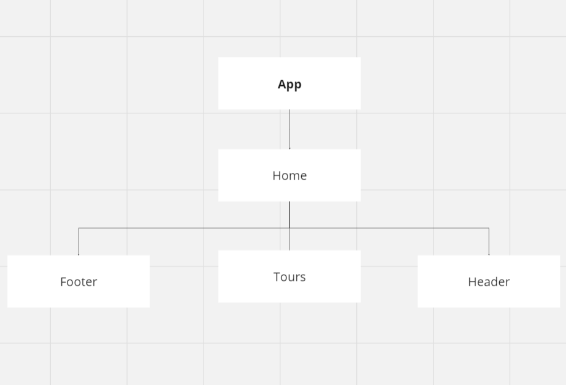

# Tousr Destination

## UI tree for the project

## Description

Tis projct contain tow main parent which is the App component is the parent and home is child for the App and parent for three components Footer,Tours and Header 

* App : render the home components
*  Home : component  render Footer,Tours and Header components
* Header : It's a H1 tag which is title
* Footer: contains Social Media Icons (Instagram,GitHUB,LinkedIN)
* Tours: render the card  of each tour.that came from home  page by using map function on array of the data.